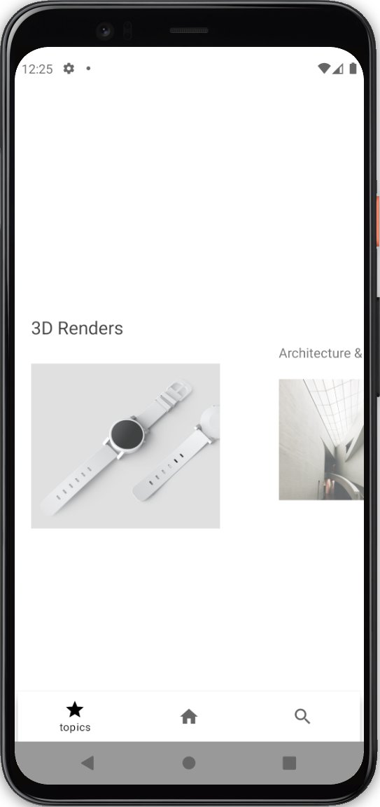
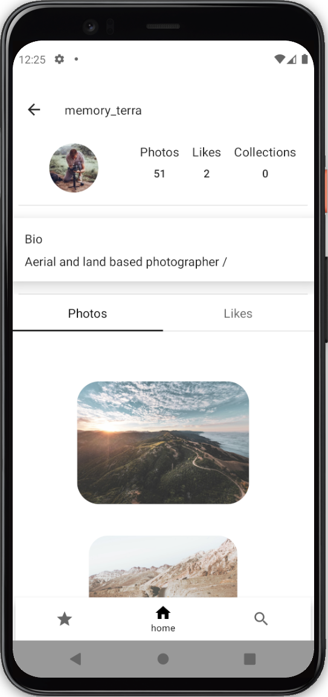

# CSplashScreen

## Table of Contents

- [Description](#description)
- [Tools](#tools)
- [Installation](#installation)
- [Screenshots](#screenshots)

### Description

SplashGallery on Compose  
The app client with Image library using Unsplash api In order with dark theme support

### Tools

- JetpackCompose
- MVVM
- Hilt (Hilt compose navigation)
- Ktor
- Coroutines / Flow
- Jetpack pagination 3 (Jetpack compose pagination)
- Jetpack compose navigation
- ViewPager (compose version)
- Coil (migrate to Glide)
- Material disign 3 (Material YOU)

### Installation

PreRelease you can download here [RELEASES](https://github.com/stslex/CSplashScreen/releases) 

### Screenshots

| Main screen                                            | Topics                                                   |
|--------------------------------------------------------|----------------------------------------------------------|
|  |    |

| Photographer profile                                   | SearchPhotos                                             |
|--------------------------------------------------------|----------------------------------------------------------|
|  |    |
