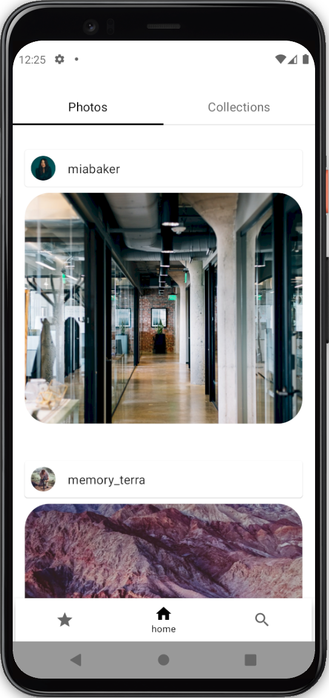

# CSplashScreen

## Table of Contents

- [Description](#description)
- [Tools](#tools)
- [Installation](#installation)
- [Screenshots](#screenshots)

### Description

SplashGallery on Compose  
The app client with Image library using Unsplash api

### Tools

- JetpackCompose
- MVVM + MVI
- Dagger (DI)
- Ktor
- Coroutines / Flow
- Jetpack paging library
- Jetpack compose navigation
- Coil
- Material design 3 (Material YOU)

### Installation

PlayMarket version [Market](https://play.google.com/store/apps/details?id=st.slex.csplashscreen)  
PreRelease you can download here [RELEASES](https://github.com/stslex/CSplashScreen/releases)
(The link is rather old, new versions will be as soon as possible)

### Screenshots

| Main screen                                            | Topics                                                 |
|--------------------------------------------------------|--------------------------------------------------------|
|  |  |

| Photographer profile                                   | SearchPhotos                                           |
|--------------------------------------------------------|--------------------------------------------------------|
|  |  |
